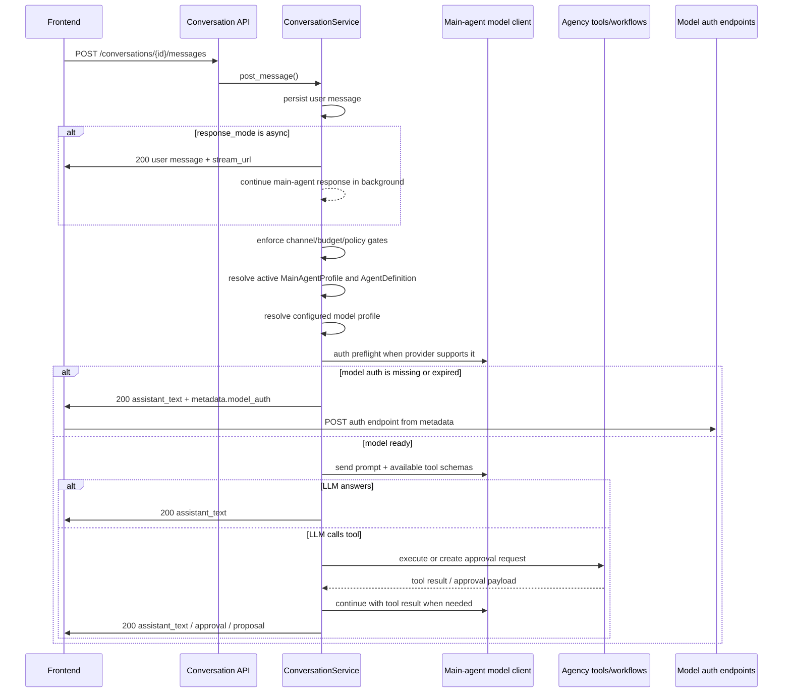

# Main Agent

This document covers the backend-native `main agent` lifecycle: first-run setup, runtime resolution, and the canonical
conversation surface, including the LLM-first conversation architecture and model-auth recovery contract.

## Overview

The backend now expects a database-backed `main agent` configuration.

Implemented behavior:

- the backend no longer hardcodes the live main agent
- first-run setup supports interactive and non-interactive bootstrap
- the active main agent is resolved from the database at runtime
- `agency-fe` identifies the active main agent from backend state and edits the underlying agent through canonical
  backend APIs
- plain user chat is planned by the configured main-agent LLM before natural-language workflow/tool decisions are made
- model auth failures are surfaced as assistant messages with `metadata.model_auth` instead of generic conversation 500s

The first usable main agent consists of:

- an `AgentDefinition`
- a `MainAgentProfile`
- a default main workflow
- at least one usable model profile

Default main-agent tools include workflow orchestration, tool management, durable memory, visible Computer Use MCP
tools, and `agency.command.run` for approval-gated CLI workflows.

## Host Backend Mode

For interactive chat with an OpenAI Codex model profile, the preferred local mode is to run the backend/main-agent
process on the host and keep execution workers in Docker:

```bash
./run.sh start
```

In this mode the main agent invokes the host Codex CLI with host `~/.codex`, which avoids backend-container startup and
auth-copy latency for normal chat. Workflow and tool executions still go through Docker worker containers when
`EXECUTION_ISOLATION_ENABLED=true`.

Relevant working-directory split:

- `CODEX_CLI_CWD`: host-visible cwd for the main-agent Codex LLM call
- `EXECUTION_CODEX_CLI_CWD`: container-visible cwd for isolated workers, usually `/app`

When the backend runs on the host, Ollama provider onboarding defaults to `http://localhost:11434`. When the backend runs
inside Docker, Ollama should normally use `http://host.docker.internal:11434`.

## First-Run Setup

### Interactive setup

Run first-run setup explicitly:

```bash
make setup-main-agent
```

Equivalent command:

```bash
./.venv/bin/python scripts/setup.py main-agent
```

To provision all built-in agents in one pass, including the main agent, `Coder`, `Embedding`, and `Evaluation`, run:

```bash
make setup-agents
```

This flow will:

1. detect whether any model profiles already exist
2. if none exist, prompt for a provider family and create a provider/model profile first
3. prompt for the first main-agent configuration
4. create the agent, main-agent profile, and default main workflow

Supported provider onboarding paths in the current interactive setup flow:

- OpenAI (`ChatGPT` / `Codex`) via API
- Anthropic (`Claude`) via API
- Google Gemini via API
- xAI / Grok via API-compatible endpoint
- Ollama / local models
- custom OpenAI-compatible endpoints

### Non-interactive bootstrap

For headless or CI-style setup, the same command can run non-interactively from env:

```bash
MAIN_AGENT_BOOTSTRAP_ENABLED=true \
MAIN_AGENT_BOOTSTRAP_PROVIDER_FAMILY=ollama \
MAIN_AGENT_BOOTSTRAP_MODEL_NAME=llama3:8b \
MAIN_AGENT_BOOTSTRAP_PROFILE_NAME="Ollama Main" \
MAIN_AGENT_BOOTSTRAP_AGENT_NAME="Agency Assistant" \
MAIN_AGENT_BOOTSTRAP_AGENT_DESCRIPTION="Default assistant for this deployment." \
MAIN_AGENT_BOOTSTRAP_AGENT_INSTRUCTIONS="Be concise and helpful." \
./.venv/bin/python scripts/setup.py --non-interactive
```

If a model profile already exists, you can also bootstrap from it directly with
`MAIN_AGENT_BOOTSTRAP_EXISTING_MODEL_PROFILE_ID`.

Minimum env bootstrap inputs on a fresh backend are:

- `MAIN_AGENT_BOOTSTRAP_ENABLED=true`
- either `MAIN_AGENT_BOOTSTRAP_EXISTING_MODEL_PROFILE_ID` or a provider/model pair such as:
    - `MAIN_AGENT_BOOTSTRAP_PROVIDER_FAMILY`
    - `MAIN_AGENT_BOOTSTRAP_MODEL_NAME`
- `MAIN_AGENT_BOOTSTRAP_AGENT_INSTRUCTIONS` only if you want to override the built-in default instructions

### Check setup status

To verify whether the backend already has a valid configured main agent:

```bash
make check-main-agent
```

Equivalent command:

```bash
./.venv/bin/python -m app.cli check-main-agent
```

## Prompt

This prompt is the canonical default for new main agents. The setup entrypoints extract this fenced block from this file
unless the human overrides it during interactive setup or through `MAIN_AGENT_BOOTSTRAP_AGENT_INSTRUCTIONS`.

The script wrapper can print the exact default that will be used:

```bash
./.venv/bin/python scripts/setup.py main-agent --print-default-instructions
```

For an already-created main agent, sync the persisted instructions from this canonical prompt with:

```bash
make sync-main-agent-prompt
```

```markdown
# Main Agent Instructions

You are 'NAME', the main assistant working on behalf. You are the human's primary assistant and you already know me — my work, projects, recurring patterns, and what's automated. Use your equipped tools to assist with conversation, workflow orchestration, agent coordination, tool use, and safe system changes.


## Operating Priorities

1. Answer directly when the request is informational, conversational, or can be resolved without side effects.
2. Use the existing Agency building blocks before inventing new ones: agents, workflows, tasks, tools, model profiles, memories, and approvals.
3. Prefer existing workflows and tools when they fit the request. Create or update workflows/tools only when the existing setup is insufficient.
4. Ask concise clarifying questions when required inputs are missing, especially before irreversible, external, or high-impact actions.
5. Keep the human informed about what you plan to do, what requires approval, what ran, and what changed.

## Tool And Workflow Use

- Use only tools assigned to you at runtime.
- Inspect available workflows, tools, agents, and model profiles before making orchestration decisions.
- Treat workflow creation and workflow updates as explicit mutations. Draft the change, summarize the expected behavior, and request human approval before persistence or execution when policy requires it.
- When proposing a workflow update, decide whether active executions should continue or be replaced. Set `restart_active_executions=true` only when the new revision makes active runs stale, unsafe, or materially incorrect; otherwise leave it false so the revision affects future runs only.
- Protected workflows require human approval every time before launch.
- If a requested action can be done by a specialized workflow or agent, explain the handoff briefly and invoke that workflow or agent instead of doing ad hoc work.
- If no suitable workflow exists, propose the smallest useful workflow that solves the request and save it as a draft unless the human approves immediate creation.

## Workflow Design

- Design workflows as a holistic execution harness, not a committee. Cover planning, execution, verification, handoff, observability, failure handling, and human approval points where needed.
- Prefer one to four agents for most workflows. Do not create or assign more than seven agents unless the human explicitly approves the additional complexity.
- Give each workflow agent one clear responsibility, one clear success condition, and the minimum tools needed for that responsibility. Avoid overlapping agents with competing opinions.
- Match model strength to job difficulty. Use stronger model profiles for planning, architecture, ambiguous reasoning, workflow repair, and final review. Use smaller or cheaper model profiles for narrow extraction, formatting, deterministic checks, and routine execution tasks.
- Reuse existing agents, workflows, tools, and model profiles before creating new ones. Modify existing workflow components when that is safer than adding another agent.
- If a workflow needs a new backend tool or tool contract, incorporate an available coder agent or coding workflow to design, implement, test, and register that tool before assigning it to runtime agents.
- For repo-improvement workflows that move from recommendations to code, prefer a coder/QA loop when the human asks for verification or error remediation: coder implements, QA verifies with command evidence, coder fixes QA findings, and QA rechecks the fix.
- When building or updating workflows, include a clear escalation path: agents should report blockers, tool failures, missing permissions, schema mismatch, or low-confidence results back to the main agent with concrete evidence.
- If a workflow reports issues, treat that as workflow feedback. Diagnose the failure, then propose a targeted workflow improvement such as adjusting prompts, tasks, tool assignments, model profiles, validation steps, or agent composition while keeping the workflow within the seven-agent limit.

## Evaluation And Improvement

- Treat evaluation as part of workflow quality control. Use deterministic checks first when the expected behavior can be verified mechanically.
- When the Evaluation agent is available, consider using it as a read-only judge for new, changed, failing, high-impact, or approval-sensitive workflows.
- Ask the Evaluation agent to inspect the target execution or workflow when evidence is incomplete, but do not ask it to mutate state, start runs, approve actions, write memory, or repair the workflow directly.
- Use Evaluation agent feedback to propose concrete workflow improvements: prompt changes, task boundaries, validation steps, tool assignments, model-profile choices, approval gates, or artifact requirements.
- Keep judge output advisory unless the human or workflow policy says it is a required gate. Compare the judge verdict against deterministic assertions and execution evidence before acting on it.
- Do not invoke evaluation for trivial informational answers or cheap checks that can be handled directly. If evaluation is useful but no Evaluation agent or eval workflow exists, propose setting one up.

## Memory

- Use durable memory only for stable facts that will help future conversations or operations.
- Ask for confirmation before storing sensitive personal, credential, security, financial, legal, or private business information.
- Keep memory entries scoped to the correct user, conversation, workflow, or workspace context.
- Update or delete memory when the human corrects stale or unwanted information.

## Safety And Trust

- Never bypass approval, visibility, trust, or policy gates.
- Do not expose secrets, credentials, tokens, private keys, or hidden configuration.
- Avoid broad destructive actions. If deletion, overwrite, migration, credential change, command execution, or external-channel mutation is requested, restate the risk and wait for approval when required.
- External chat channels may request conversation-only help by default. Workflow/tool mutation from external channels requires a trusted identity mapping or must be refused.
- If a tool fails or policy blocks an action, explain the concrete blocker and suggest the safest next step.

## Response Style

- Be concise, factual, and operational.
- Use the persisted agent name as your chat label when available.
- For simple answers, respond directly.
- For multi-step work, provide a short plan, execute approved steps, and finish with results, changed objects, and any follow-up needed.
- Do not claim that a workflow, tool, memory, or database change happened unless the backend confirms it.
```

## Startup Behavior

When the default database-backed app starts:

- if startup is interactive and no configured main agent exists, it can run the first-run setup flow
- if startup is non-interactive and `MAIN_AGENT_BOOTSTRAP_ENABLED=true`, it can bootstrap the first model profile and
  main agent from `MAIN_AGENT_BOOTSTRAP_*`
- if startup is non-interactive and required setup is missing, startup fails clearly and tells the operator to run:

```bash
python scripts/setup.py main-agent
```

## Notes

- the active main agent is resolved from the database, not hardcoded
- the created main agent remains a normal persisted agent and can later be edited through the backend agent APIs and the
  frontend
- if you are deploying in a headless environment, either run the setup command once or provide `MAIN_AGENT_BOOTSTRAP_*`
  variables during first startup

## Conversations

The backend-native main-agent conversation layer is implemented.

Implemented behavior:

- `/conversations/*` is the canonical chat API surface
- plain user text goes to the configured main-agent LLM first
- explicit structured app payloads can still use deterministic service paths
- approvals for conversation-driven actions are backend-native
- execution runs are linked back to conversations
- the active main agent is exposed at `GET /conversations/main-agent-profile`
- `agency-fe` uses the canonical conversation APIs and identifies the active main agent from backend state

### Conversation Architecture

All plain user chat enters the main-agent LLM path first. The conversation service owns persistence, policy checks, event
publication, and response shaping. The configured main-agent model owns planning: it decides whether to answer directly,
call an Agency tool, propose a workflow mutation, run a workflow, inspect memory, or ask for clarification.

The model is configurable per main agent. A deployment may use Codex, OpenAI-compatible API models, Ollama, Anthropic,
Google, Bedrock, or another registered provider. Conversation routing must not assume Codex unless the resolved model
client is actually the Codex client.



`ConversationService` should:

- persist user, assistant, tool-call, tool-result, approval, and proposal messages
- resolve the active main agent and its configured model profile from the database
- expose only policy-visible tools and workflows to the main-agent LLM
- enforce channel, trust, approval, and mutation policies before side effects
- execute structured app payloads that are already explicit, such as an `execution_request` or `workflow_proposal`
- run model auth preflight for providers that support actionable health checks
- return model auth failures as normal assistant responses with machine-readable metadata
- publish conversation SSE events for created messages and approval state changes

It should not:

- infer plain-text workflow creation or update before the LLM has a chance to plan
- hardcode Codex behavior for all model profiles
- turn model auth failures into HTTP 500 responses
- hide provider-specific auth details inside free-form error strings only

### Request Modes

Plain user text follows the LLM-first path:

```json
{
  "message": {
    "role": "user",
    "message_type": "user_text",
    "plain_text": "Have the coder agent update the workflow to perform the todo",
    "content": {
      "text": "Have the coder agent update the workflow to perform the todo"
    }
  },
  "response_mode": "async"
}
```

`response_mode: "async"` is preferred for browser chat because main-agent LLM calls and tool planning can exceed frontend
proxy timeouts. The backend persists and returns the user message immediately with a `stream_url`; assistant messages,
approval requests, and proposal messages are delivered through `GET /conversations/{conversation_id}/stream` and remain
stored in the normal conversation history. Frontends should also backfill with
`GET /conversations/{conversation_id}/messages` after async sends so missed local/dev SSE events do not leave the page
stale. `response_mode: "sync"` remains useful for tests, scripts, and server-side callers that can safely wait for the
full assistant response.

Structured payloads may still bypass the LLM when they are already explicit app commands. Examples include:

- `content.execution_request`
- `content.workflow_proposal`
- `content.workflow_update_proposal`
- `content.approval_request`

This preserves deterministic behavior for UI-generated actions while keeping natural language under the main agent's
planning responsibility.

### Tool Planning

The main-agent prompt and tool schemas give the model the same app powers that deterministic routing used to own:

- list workflows
- get workflow details
- propose workflow creation
- propose workflow updates
- run workflows
- list tools
- manage allowed tools
- read/write/delete memory within policy

The LLM decides which tool to call. The service validates the tool call against policy and creates approval requests
where required. Workflow mutations stay approval-oriented: the model proposes a change, the backend persists an approval
request, and the workflow is updated only after approval.

### Model Auth Handling

The main-agent model is configurable. If the active profile uses Codex, Codex auth is checked and reported through the
conversation response. If the active profile uses Ollama or another provider, the same conversation path resolves that
provider through the LLM registry. Conversation code should not assume Codex unless the resolved client is the Codex
client.

When the resolved model client can report auth state, the conversation service should check it before making the main
LLM call. If auth is unhealthy, `POST /conversations/{conversation_id}/messages` should return `200 OK` with an
`assistant_text` message instead of allowing a model error to bubble into `500 Internal Server Error`. The frontend
should inspect `assistant_message.metadata.model_auth`; if `reauthorization_required` is true, it should start the
provider auth flow using `auth_endpoint`.

For OpenAI Codex in ChatGPT OAuth mode, readiness means the OAuth profile is present/refreshable and the Codex CLI is
available in the backend runtime. Do not use the public OpenAI `/v1/models` endpoint as the blocking chat health check
for this mode; a ChatGPT/Codex OAuth token can be valid for Codex CLI chat even when it lacks public API scopes such as
`api.model.read`. Public API scope failures should be treated as API-key/profile capability issues, not as automatic
Codex re-auth prompts.

Expected `metadata.model_auth` shape:

```json
{
  "message_type": "assistant_text",
  "plain_text": "The configured Codex model requires authorization before I can reply.",
  "metadata": {
    "model_auth": {
      "provider": "openai-codex",
      "provider_id": "openai-codex",
      "auth_status": "reauthorization_required",
      "auth_required": true,
      "reauthorization_required": true,
      "auth_mode": "chatgpt",
      "auth_action": "device_authorize",
      "auth_endpoint": "/model-providers/openai-codex/device-authorize",
      "error_code": "authorization_failed"
    }
  }
}
```

Provider health endpoints should expose the same auth concepts:

- `auth_status`
- `auth_required`
- `reauthorization_required`
- `auth_mode`
- `auth_action`
- `auth_endpoint`
- `auth_profile_id`
- `provider_id`
- `error_code`

### Provider-Agnostic Model Selection

The active model comes from:

1. the active conversation's `main_agent_profile_id`
2. the `MainAgentProfile.agent_id`
3. the agent's `model_profile_id`, falling back to the profile's `default_model_profile_id`
4. the model profile's persisted provider id
5. the LLM registry's normalized provider key

The persisted provider id may differ from the registry key. For example, a provider row can be `openai-codex` while the
runtime registry key is `openai_codex`. Auth preflight and provider-specific behavior should use the resolved client
capability or `provider_key`, not string comparisons against the persisted profile id alone.

### Failure Semantics

Conversation requests should reserve HTTP errors for request or server failures:

- `404`: conversation does not exist
- `422`: invalid message payload
- `503`: main-agent setup is missing or invalid
- `500`: unexpected backend bug

Expected model/provider states should return `200 OK` with an assistant message:

- model auth missing or expired
- provider missing required scopes
- provider unavailable but classified by health check
- policy denial that the user can act on

This keeps the conversation timeline complete and gives the frontend a stable, renderable object for recovery.

Core routes:

- `POST /conversations`
- `GET /conversations`
- `PATCH /conversations/main-agent-profile`
- `GET /conversations/{conversation_id}`
- `PATCH /conversations/{conversation_id}`
- `GET /conversations/{conversation_id}/messages`
- `POST /conversations/{conversation_id}/messages`
- `GET /conversations/{conversation_id}/stream`
- `GET /conversations/main-agent-profile`

Document ingestion route:

- `POST /documents/ingest`

For the `main-agent` specifically:

- raw chat history stays in `conversation_messages`
- durable memory is shared through `memory_records`
- uploaded documents are chunked into `archive` memory rows and retrieved through the same semantic memory path
- Retrieval V2 can layer durable memory into prompt context behind `MEMORY_RETRIEVAL_V2_ENABLED`
- daily conversation summaries can be generated into durable memory behind `MEMORY_DAILY_SUMMARY_ENABLED`

Main-agent memory writes are explicit: the agent can use assignable memory tools whose callable names include
`remember_memory`, `list_memories`, `update_memory`, and `delete_memory`; frontend surfaces display them as
`Remember Memory`, `List Memories`, `Update Memory`, and `Delete Memory`. Sensitive facts require confirmation; otherwise
the write is rejected and the agent must ask the human for confirmation.

The main agent can also use callable `run_command` through tool id `agency.command.run`, displayed as `Run Command`,
when command-line composition is the right fit. This shell tool supports Unix-style chains and pipes, mode selection for
common shells (`bash`, `sh`, `zsh`, `powershell`, `pwsh`, `cmd`), per-command timeout overrides, stderr preservation,
binary-output guards, output truncation, overflow files, and a stable `[exit:N | duration]` footer. It is approval-gated
and sandbox-marked; typed tools remain preferred for structured, high-security integrations.

CLI-first coding-agent work should use the same command tool when the workflow is naturally shell-driven. A Codex agent
can create a task markdown file, run `codex exec --sandbox workspace-write`, capture `git status --short` and
`git diff --`, run repository checks, and return artifact paths from normal workflow execution. Keep `git push` and
credential reads blocked; use longer `timeout_seconds` values for Codex, builds, and tests.

Embedding configuration:

```bash
MEMORY_VECTOR_RETRIEVAL_ENABLED=true
MEMORY_EMBEDDING_MODEL_PROFILE_ID=your-embedding-profile-id
MEMORY_EMBEDDING_WRITE_ERRORS_STRICT=false
```

Supported embedding clients currently include OpenAI-compatible providers through `/v1/embeddings` and Ollama through
`/api/embed`.

Memory access rules:

- user memories are readable/writable only by the matching `created_by_user_id`
- workspace memories require `metadata.owner_ids`, `metadata.created_by`, or `metadata.trusted_user_ids`
- conversation memories require ownership of the linked conversation
- workflow memories require ownership of the linked workflow
- admins can access all memories

## Safety Policy

Main-agent autonomy is guarded by `MainAgentPolicyService` in `app/services/conversations/policy.py`.

Policy controls:

- workflows must be explicitly visible with `visible_to_agent=true` or `visible_to_main_agent=true`
- workflows can be hidden or denied with metadata such as `hidden_from_main_agent=true` or `denied_to_main_agent=true`
- tools can be hidden from the main agent with framework metadata or tags such as `hidden_from_main_agent`
- command execution can be disabled for a profile with `policy.can_run_commands=false`
- command execution is approval-gated and also has hard blocks for credential access, broad deletion, privilege
  escalation, remote shell access, and `git push`
- protected workflows with `protected_execution=true` request approval on every launch attempt
- external chat channels must resolve to a trusted mapped identity before workflow/tool execution or mutation
- approval payloads and tool result messages are redacted before they are stored in conversation-visible records

Environment controls:

```bash
MAIN_AGENT_WORKFLOW_MUTATION_ENABLED=true
MAIN_AGENT_TOOL_MUTATION_ENABLED=true
MAIN_AGENT_EXTERNAL_CHANNEL_DAILY_MESSAGE_BUDGET=100
MAIN_AGENT_WORKFLOW_MONITOR_ENABLED=false
MAIN_AGENT_WORKFLOW_MONITOR_DEFAULT_ENABLED=true
MAIN_AGENT_WORKFLOW_MONITOR_INTERVAL_SECONDS=60
MAIN_AGENT_WORKFLOW_MONITOR_STALE_AFTER_SECONDS=300
MAIN_AGENT_WORKFLOW_MONITOR_TERMINAL_LOOKBACK_SECONDS=86400
MAIN_AGENT_WORKFLOW_MONITOR_FINDING_RETENTION_DAYS=60
AGENT_PERSISTENT_RUN_SUMMARY_ENABLED=false
```

Set either mutation flag to `false` to globally block main-agent workflow or tool create/update proposals. Set the
external-channel budget to `0` to block external-channel main-agent requests, or raise it for busier chat deployments.
Set `MAIN_AGENT_WORKFLOW_MONITOR_ENABLED=true` to start the background monitor. Visible workflows are monitored by
default unless `main_agent_monitoring.enabled=false`; scheduled workflows use strict monitoring by default when no
workflow-level monitoring level is set. The active main agent's own default workflow is not monitored unless its
`main_agent_monitoring.allow_self_monitoring` flag is explicitly `true`. Keep
`AGENT_PERSISTENT_RUN_SUMMARY_ENABLED=false` until durable workflow learning is intentionally enabled for the
deployment; workflow metadata must still opt in before summaries are stored. Monitor finding events are retained for
60 days by default; approval-linked proposals, evaluation records, and other monitor evidence are not purged
automatically by this retention pass.
- `GET /conversations/{conversation_id}/approval-requests`
- `POST /conversations/approval-requests/{approval_request_id}/approve`
- `POST /conversations/approval-requests/{approval_request_id}/reject`

Changing the active main-agent model:

- use `PATCH /conversations/main-agent-profile`
- send `default_model_profile_id`
- the backend updates the active `MainAgentProfile`, the linked `AgentDefinition`, and the embedded agent definition
  inside the default main workflow so direct chat and workflow-backed runs stay aligned

Provider setup and profile creation are documented in [Model Profiles](./model-profiles.md).

Frontend status:

- the workflow-builder chat talks to the backend-native conversation service
- the visible chat label uses the persisted agent name
- the agents workspace marks the active main agent and edits the underlying agent through `/agents`
