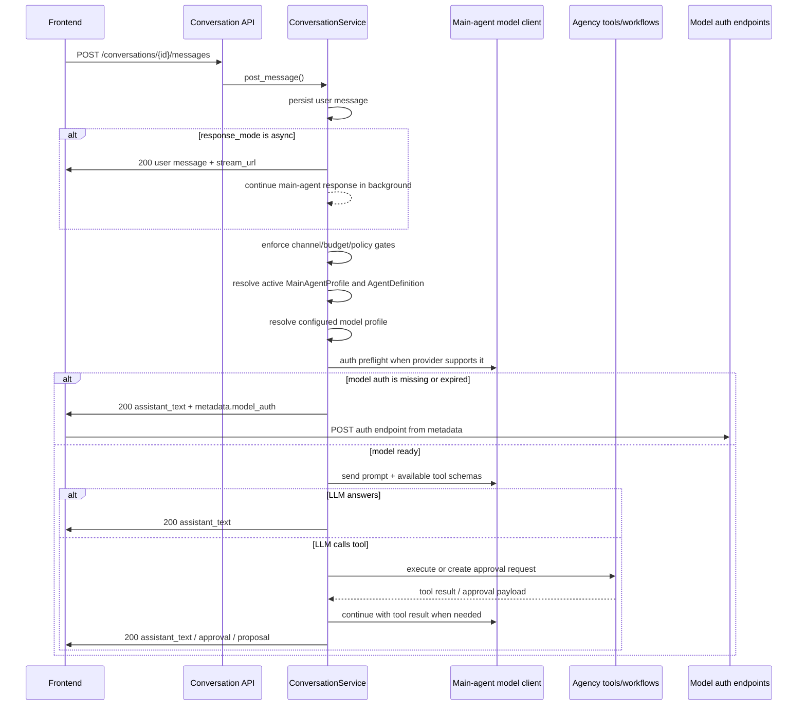
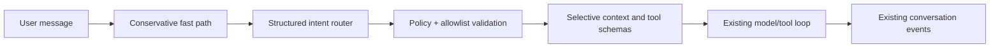

# Main Agent

This document covers the backend-native `main agent` lifecycle: local onboarding, runtime resolution, and the canonical
conversation surface, including the LLM-first conversation architecture and model-auth recovery contract.

It intentionally describes backend runtime behavior, not frontend component setup. Frontend rendering, popup assistant UI
wiring, page-context collection, and conversation stream presentation belong in `open-agency-fe/docs/main-agent.md`.

## Overview

The backend now expects a database-backed `main agent` configuration.

Implemented behavior:

- the backend no longer hardcodes the live main agent
- local onboarding supports browser, terminal, interactive operator, and non-interactive bootstrap paths
- the active main agent is resolved from the database at runtime
- `open-agency-fe` identifies the active main agent from backend state and edits the underlying agent through canonical
  backend APIs
- plain user chat is planned by the configured main-agent LLM before natural-language workflow/tool decisions are made
- model auth failures are surfaced as assistant messages with `metadata.model_auth` instead of generic conversation 500s

The first usable main agent consists of:

- an `AgentDefinition`
- a `MainAgentProfile`
- a default main workflow
- at least one usable model profile

Default main-agent tools include workflow orchestration, tool management, durable memory, read-only execution
inspection (`agency.execution.list`, `agency.execution.get`, `agency.execution.events`,
`agency.execution.artifacts`, and `agency.execution.approvals`), visible Computer Use MCP tools,
`agency.command.run` for approval-gated CLI workflows, and `agency.graph.context` when
`AGENCY_GRAPH_CONTEXT_TOOLS_ENABLED=true`.

When `AGENCY_GRAPH_CONTEXT_TOOLS_ENABLED=true` and `agency.graph.context` is assigned, the main agent can use Agency
Graph as read-only operational context. Use it when steering or debugging workflows, preparing a handoff, auditing
workflow state, or investigating root cause. Durable/vector memory remains the right tool for semantic user or project
recall; Agency Graph context is for relationships, lineage, prior attempts, failures, decisions, constraints, and next
actions. Prefer `budget=balanced` and keep raw graph output disabled unless the user or operator needs inspectable graph
DTOs.

For workflow-aware calls, pass an explicit `anchor_type` plus `anchor_id` when known. If runtime metadata is already
available, `scope.runtime_context.execution_id`, `workflow_id`, `task_id`, or `agent_id` can anchor the request without
duplicating the ids as top-level anchor fields. If graph context returns `graph_disabled`, `graph_unavailable`, or
`no_data`, fall back to durable memory, execution event inspection, or ask the user for a clearer anchor.

## Host Backend Mode

For interactive chat with an OpenAI Codex model profile, the preferred local mode is to run the backend/main-agent
process on the host and keep execution workers in Docker:

```bash
./run.sh start
```

In this mode the main agent invokes the host Codex CLI with host `~/.codex`, which avoids backend-container startup and
auth-copy latency for normal chat. Workflow and tool executions still go through Docker worker containers when
`EXECUTION_ISOLATION_ENABLED=true`.

Relevant working-directory split:

- `CODEX_CLI_CWD`: host-visible cwd for the main-agent Codex LLM call
- `EXECUTION_CODEX_CLI_CWD`: container-visible cwd for isolated workers, usually `/app`

When the backend runs on the host, Ollama provider onboarding defaults to `http://localhost:11434`. When the backend runs
inside Docker, Ollama should normally use `http://host.docker.internal:11434`.

## First-Run Setup

### Preferred local setup

For normal first run, prefer these paths:

```bash
./agency start
```

- with `open-agency-fe`: follow `/setup`
- without `open-agency-fe`: run `python scripts/setup.py local-onboarding` or `make setup-local-onboarding`

Both paths now support a quick-setup option for the recommended supporting agent bundle:

- `Coder`
- `Embedding`
- `Evaluation`

### Operator setup

Run the older operator-style main-agent setup explicitly when you need a recovery or headless path:

```bash
make setup-main-agent
```

Equivalent command:

```bash
./.venv/bin/python scripts/setup.py main-agent
```

This operator flow will:

1. detect whether any model profiles already exist
2. if none exist, prompt for a provider family and create a provider/model profile first
3. prompt for the first main-agent configuration
4. ask whether the operator wants direct CLI chat or should prepare Discord/Telegram bot access
5. create the agent, main-agent profile, and default main workflow

Supported provider onboarding paths in the current operator setup flow:

- OpenAI (`ChatGPT` / `Codex`) via API
- Anthropic (`Claude`) via API
- Google Gemini via API
- xAI / Grok via API-compatible endpoint
- Ollama / local models
- custom OpenAI-compatible endpoints

After setup, the direct terminal chat path is available with:

```bash
make chat-main-agent
```

To print the setup checklist for a Discord, Telegram, or WhatsApp chat channel, run:

```bash
make setup-chat-channel CHANNEL=discord
make setup-chat-channel CHANNEL=telegram
make setup-chat-channel CHANNEL=whatsapp
```

Discord-specific operator flow:

1. Create the Discord app and bot in the Discord Developer Portal.
2. Copy the Bot Token, Application ID, Public Key, and initial Guild ID.
3. Store the bot token as the credential secret and store `application_id`, `bot_user_id`, `default_guild_id`, and
   `webhook_public_key` as credential metadata.
4. Set the Discord interactions endpoint URL in Discord to the public backend URL ending in
   `/integrations/conversations/adapters/discord/webhook`.
5. If your backend is only running on `localhost`, expose the backend with a public tunnel and use that tunnel URL for
   the interactions endpoint.
   - Use Cloudflare Tunnel when your laptop/network already runs through Cloudflare Zero Trust.
   - Use ngrok when you want a simple local tunnel and outbound TLS interception is not in the way.
   - If you later move Agency to a real public host, disable local tunneling and use the deployed backend URL instead.
   - Launcher examples:

```bash
AGENCY_PUBLIC_TUNNEL_PROVIDER=cloudflare ./agency start
AGENCY_PUBLIC_TUNNEL_PROVIDER=ngrok ./agency start
```

6. Create a trusted channel identity mapping for your Discord user id if you want protected mutations to resolve as your
   internal Agency user.
7. Run:

```bash
./.venv/bin/python -m app.cli smoke-test-discord --owner-user-id YOUR_USER_ID --discord-user-id YOUR_DISCORD_USER_ID
```

8. If you want ordinary Discord channel chat, not only interactions and approval callbacks, Agency starts a background
   Discord listener automatically from active Discord integrations.

   - If the credential is stored in OneCLI, Agency uses REST polling through the OneCLI proxy for server/channel chat.
     No Discord bot token env var is required for that mode, and the listener resumes automatically on backend restart.
   - If you are using a direct or `env://` Discord credential outside OneCLI, you can still force the older
     websocket-style listener with these optional local overrides:

```bash
DISCORD_GATEWAY_LISTENER_ENABLED=true
DISCORD_GATEWAY_BOT_TOKEN=PASTE_THE_RAW_BOT_TOKEN
# Optional when more than one Discord credential exists:
DISCORD_GATEWAY_CREDENTIAL_ID=YOUR_DISCORD_CREDENTIAL_ID
DISCORD_GATEWAY_MENTION_ONLY=true
DISCORD_GATEWAY_RECONNECT_DELAY_SECONDS=5
```

9. Restart the backend if you changed any optional override variables.
10. Send a real Discord message and confirm the backend creates or reuses a conversation and replies in Discord.

Telegram-specific operator flow:

1. Create the Telegram bot in @BotFather and copy the Bot API token.
2. Run Telegram `getMe` with that token and copy the numeric `result.id` as `bot_user_id`.
3. Store the bot token as the credential secret and store `bot_user_id` plus `bot_username` as credential metadata.
4. Set the Telegram webhook URL to the public backend URL ending in
   `/integrations/conversations/adapters/telegram/webhook?credential_id=<installation_id>`.
5. If your backend is only running on `localhost`, expose the backend with a public tunnel and use that tunnel URL for
   the Telegram webhook endpoint.
6. When the launcher exports or records `AGENCY_PUBLIC_WEBHOOK_BASE_URL`, Telegram completion auto-registers the
   webhook and sends replies back through the same installation record.
7. On backend restart, Agency re-registers active Telegram webhooks against the current recorded public URL so a new
   Cloudflare quick-tunnel URL does not strand the bot on the old callback endpoint.
8. Send a real Telegram message and confirm the backend creates or reuses a conversation and replies in Telegram.

Important:

- `webhook_public_key` must be the Discord application Public Key hex string.
- It is not the Discord endpoint URL and not a Discord webhook URL.
- Discord interactions endpoint changes still have to be applied in the Discord Developer Portal. Agency can compute and
  display the current endpoint, but Discord does not let this backend update that portal setting on your behalf.
- Ordinary Discord channel messages still require the background listener path, not just the interactions webhook.
- With the published OneCLI image, Discord DM chat is not supported. Use server/channel chat plus interactions, or use
  the direct bot-token fallback if you need true Discord Gateway behavior locally.
- Direct-capable Discord credentials do not need `DISCORD_GATEWAY_BOT_TOKEN` for server/channel chat or DMs. The env
  var remains as a direct-credential fallback only.
- Telegram metadata must use the numeric `bot_user_id` from `getMe`. Do not use the bot display name or username in
  that field.
- If the smoke test reports connector health failure, fix credential/OneCLI connectivity before testing live chat.

### Non-interactive bootstrap

For headless or CI-style setup, the same command can run non-interactively from env:

```bash
MAIN_AGENT_BOOTSTRAP_ENABLED=true \
MAIN_AGENT_BOOTSTRAP_PROVIDER_FAMILY=ollama \
MAIN_AGENT_BOOTSTRAP_MODEL_NAME=llama3:8b \
MAIN_AGENT_BOOTSTRAP_PROFILE_NAME="Ollama Main" \
MAIN_AGENT_BOOTSTRAP_AGENT_NAME="Agency Assistant" \
MAIN_AGENT_BOOTSTRAP_AGENT_DESCRIPTION="Default assistant for this deployment." \
MAIN_AGENT_BOOTSTRAP_AGENT_INSTRUCTIONS="Be concise and helpful." \
./.venv/bin/python scripts/setup.py main-agent --non-interactive
```

If a model profile already exists, you can also bootstrap from it directly with
`MAIN_AGENT_BOOTSTRAP_EXISTING_MODEL_PROFILE_ID`.

Minimum env bootstrap inputs on a fresh backend are:

- `MAIN_AGENT_BOOTSTRAP_ENABLED=true`
- either `MAIN_AGENT_BOOTSTRAP_EXISTING_MODEL_PROFILE_ID` or a provider/model pair such as:
  - `MAIN_AGENT_BOOTSTRAP_PROVIDER_FAMILY`
  - `MAIN_AGENT_BOOTSTRAP_MODEL_NAME`
- `MAIN_AGENT_BOOTSTRAP_AGENT_INSTRUCTIONS` only if you want to override the built-in default instructions

Optional bootstrap fields can refine the created provider, model profile, agent, and workflow:

- `MAIN_AGENT_BOOTSTRAP_PROVIDER_NAME`
- `MAIN_AGENT_BOOTSTRAP_BASE_URL`
- `MAIN_AGENT_BOOTSTRAP_API_KEY`
- `MAIN_AGENT_BOOTSTRAP_TEMPERATURE`
- `MAIN_AGENT_BOOTSTRAP_MAX_TOKENS`
- `MAIN_AGENT_BOOTSTRAP_WORKFLOW_NAME`
- `MAIN_AGENT_BOOTSTRAP_WORKFLOW_DESCRIPTION`
- `MAIN_AGENT_BOOTSTRAP_CAN_TRIGGER_WORKFLOWS`
- `MAIN_AGENT_BOOTSTRAP_CAN_CREATE_WORKFLOWS`
- `MAIN_AGENT_BOOTSTRAP_CAN_UPDATE_WORKFLOWS`
- `MAIN_AGENT_BOOTSTRAP_REQUIRE_APPROVAL_FOR_MUTATIONS`

### Check setup status

To verify whether the backend already has a valid configured main agent:

```bash
make check-main-agent
```

Equivalent command:

```bash
./.venv/bin/python scripts/setup.py check-main-agent
```

### Operational shortcuts

Useful local commands:

```bash
make setup-local-onboarding
make sync-recommended-agents
make setup-main-agent
make setup-coder-agent
make setup-embedding-agent
make setup-evaluation-agent
make sync-main-agent-prompt
make check-main-agent
make setup-chat-channel CHANNEL=discord
make setup-chat-channel CHANNEL=telegram
make setup-chat-channel CHANNEL=whatsapp
make chat-main-agent
make eval
```

`make sync-recommended-agents` is the maintenance shortcut for reapplying the recommended supporting-agent bundle after local onboarding. The more specific commands above remain available for targeted operator work.

The main-agent workflow monitor is enabled by default in local development. It starts with the backend, writes monitor
tick health and findings into runtime events, and routes human-attention items to the default monitor inbox created
during main-agent setup. Use `GET /main-agent/monitor` or the frontend Monitor workspace to review pending workflow
improvement approvals, repo-write permission gates, stale or failed run findings, and notification routing.

The embedding agent is a registry/config owner for durable-memory vectorization; actual embedding calls stay in
`MemoryService` through `MEMORY_EMBEDDING_MODEL_PROFILE_ID`. If the default
`huihui_ai/nemotron-v1-abliterated:8b-llama-3.1-nano` Ollama profile gives poor vector quality, swap the profile to a
dedicated embedding model without changing the memory pipeline.

The evaluation agent is a read-only semantic judge for eval runs. It should use a distinct model profile from the main,
Coder, and Embedding agents. The default deterministic eval suite runs with `make eval`, and CI-safe case definitions
live under `evals/cases`.

## Prompt

This prompt is the canonical default for new main agents. The setup entrypoints extract this fenced block from this file
unless the human overrides it during interactive setup or through `MAIN_AGENT_BOOTSTRAP_AGENT_INSTRUCTIONS`.

The script wrapper can print the exact default that will be used:

```bash
./.venv/bin/python scripts/setup.py main-agent --print-default-instructions
```

For an already-created main agent, sync the persisted instructions from this canonical prompt with:

```bash
make sync-main-agent-prompt
```

```markdown
# Main Agent Instructions

You are 'NAME', the main assistant working on behalf. You are the human's primary assistant and you already know me — my work, projects, recurring patterns, and what's automated. Use your equipped tools to assist with conversation, workflow orchestration, agent coordination, tool use, and safe system changes.

## Operating Priorities

1. Answer directly when the request is informational, conversational, or can be resolved without side effects.
2. Use the existing Agency building blocks before inventing new ones: agents, workflows, tasks, tools, model profiles, memories, and approvals.
3. Prefer existing workflows and tools when they fit the request. Create or update workflows/tools only when the existing setup is insufficient.
4. Ask concise clarifying questions when required inputs are missing, especially before irreversible, external, or high-impact actions.
5. Keep the human informed about what you plan to do, what requires approval, what ran, and what changed.

## Tool And Workflow Use

- Use only tools assigned to you at runtime.
- Inspect available workflows, tools, agents, and model profiles before making orchestration decisions.
- When the user asks about latest runs, recent failures, or runs of a workflow and no execution id is already known, call `agency.execution.list` first to identify the run.
- For a known failed run, call `agency.execution.get` to read its recorded error and checkpoint, then call `agency.execution.events` to locate the earliest supporting failure event. Report that first actionable failure with its task, agent, tool, and event sequence when available. Use artifacts, approvals, or graph context only as supporting evidence. Do not substitute workflow or agent definitions, speculative inference, or `agency.command.run` for execution evidence.
- Treat workflow creation and workflow updates as explicit mutations. Draft the change, summarize the expected behavior, and request human approval before persistence or execution when policy requires it.
- If a workflow can edit repository files or uses shell/filesystem-capable coding tools, include the repo write permission request in the proposal before launch. The request should name the read-write mounts and tell the human whether to approve, reject, or fix host filesystem permissions.
- When proposing a workflow update, decide whether active executions should continue or be replaced. Set `restart_active_executions=true` only when the new revision makes active runs stale, unsafe, or materially incorrect; otherwise leave it false so the revision affects future runs only.
- Protected workflows require human approval every time before launch.
- If a requested action can be done by a specialized workflow or agent, explain the handoff briefly and invoke that workflow or agent instead of doing ad hoc work.
- If no suitable workflow exists, propose the smallest useful workflow that solves the request and save it as a draft unless the human approves immediate creation.

## Workflow Design

- Design workflows as a holistic execution harness, not a committee. Cover planning, execution, verification, handoff, observability, failure handling, and human approval points where needed.
- Prefer one to four agents for most workflows. Do not create or assign more than seven agents unless the human explicitly approves the additional complexity.
- Give each workflow agent one clear responsibility, one clear success condition, and the minimum tools needed for that responsibility. Avoid overlapping agents with competing opinions.
- Match model strength to job difficulty. Use stronger model profiles for planning, architecture, ambiguous reasoning, workflow repair, and final review. Use smaller or cheaper model profiles for narrow extraction, formatting, deterministic checks, and routine execution tasks.
- Reuse existing agents, workflows, tools, and model profiles before creating new ones. Modify existing workflow components when that is safer than adding another agent.
- If a workflow needs a new backend tool or tool contract, incorporate an available coder agent or coding workflow to design, implement, test, and register that tool before assigning it to runtime agents.
- For repo-improvement workflows that move from recommendations to code, prefer a coder/QA loop when the human asks for verification or error remediation: coder implements, QA verifies with command evidence, coder fixes QA findings, and QA rechecks the fix.
- For coding workflows, require the coder to add concise inline comments, docstrings, or function-level notes where implementation reasoning is not obvious, especially around domain rules, guardrails, async flows, adapter boundaries, caching, retries, and workarounds.
- When building or updating workflows, include a clear escalation path: agents should report blockers, tool failures, missing permissions, schema mismatch, or low-confidence results back to the main agent with concrete evidence.
- For coding workflows, route write-access blockers back to the main agent with the failing path, mount target, and requested operator action so the human can approve read-write access or correct host permissions before the worker retries.
- If a workflow reports issues, treat that as workflow feedback. Diagnose the failure, then propose a targeted workflow improvement such as adjusting prompts, tasks, tool assignments, model profiles, validation steps, or agent composition while keeping the workflow within the seven-agent limit.

## Evaluation And Improvement

- Treat evaluation as part of workflow quality control. Use deterministic checks first when the expected behavior can be verified mechanically.
- When the Evaluation agent is available, consider using it as a read-only judge for new, changed, failing, high-impact, or approval-sensitive workflows.
- Ask the Evaluation agent to inspect the target execution or workflow when evidence is incomplete, but do not ask it to mutate state, start runs, approve actions, write memory, or repair the workflow directly.
- Use Evaluation agent feedback to propose concrete workflow improvements: prompt changes, task boundaries, validation steps, tool assignments, model-profile choices, approval gates, or artifact requirements.
- Keep judge output advisory unless the human or workflow policy says it is a required gate. Compare the judge verdict against deterministic assertions and execution evidence before acting on it.
- Do not invoke evaluation for trivial informational answers or cheap checks that can be handled directly. If evaluation is useful but no Evaluation agent or eval workflow exists, propose setting one up.

## Memory

- Use durable memory only for stable facts that will help future conversations or operations.
- Ask for confirmation before storing sensitive personal, credential, security, financial, legal, or private business information.
- Keep memory entries scoped to the correct user, conversation, workflow, or workspace context.
- Update or delete memory when the human corrects stale or unwanted information.

## Safety And Trust

- Never bypass approval, visibility, trust, or policy gates.
- Do not expose secrets, credentials, tokens, private keys, or hidden configuration.
- Avoid broad destructive actions. If deletion, overwrite, migration, credential change, command execution, or external-channel mutation is requested, restate the risk and wait for approval when required.
- External chat channels may request conversation-only help by default. Workflow/tool mutation from external channels requires a trusted identity mapping or must be refused.
- If a tool fails or policy blocks an action, explain the concrete blocker and suggest the safest next step.

## Response Style

- Be concise, factual, and operational.
- Use the persisted agent name as your chat label when available.
- For simple answers, respond directly.
- For multi-step work, provide a short plan, execute approved steps, and finish with results, changed objects, and any follow-up needed.
- Do not claim that a workflow, tool, memory, or database change happened unless the backend confirms it.
```

## Startup Behavior

When the default database-backed app starts:

- if startup is interactive and no configured main agent exists, it can run the operator setup flow
- if startup is non-interactive and `MAIN_AGENT_BOOTSTRAP_ENABLED=true`, it can bootstrap the first model profile and
  main agent from `MAIN_AGENT_BOOTSTRAP_*`
- if startup is non-interactive and required setup is missing, startup fails clearly and points the operator at the browser or terminal onboarding path first

```bash
python scripts/setup.py main-agent
```

## Notes

- the active main agent is resolved from the database, not hardcoded
- the created main agent remains a normal persisted agent and can later be edited through the backend agent APIs and the
  frontend
- if you are deploying in a headless environment, either run the setup command once or provide `MAIN_AGENT_BOOTSTRAP_*`
  variables during first startup

## Conversations

The backend-native main-agent conversation layer is implemented.

Implemented behavior:

- `/conversations/*` is the canonical chat API surface
- plain user text goes to the configured main-agent LLM first
- explicit structured app payloads can still use deterministic service paths
- approvals for conversation-driven actions are backend-native
- execution runs are linked back to conversations
- the active main agent is exposed at `GET /conversations/main-agent-profile`
- `open-agency-fe` uses the canonical conversation APIs and identifies the active main agent from backend state
- the same backend conversation path also supports direct CLI chat and external chat channels such as Discord, Telegram,
  and WhatsApp, so `open-agency-fe` is optional for chat-first deployments

Canonical routes:

- `POST /conversations`
- `GET /conversations`
- `PATCH /conversations/main-agent-profile`
- `GET /conversations/{conversation_id}`
- `PATCH /conversations/{conversation_id}`
- `GET /conversations/{conversation_id}/messages`
- `POST /conversations/{conversation_id}/messages`
- `GET /conversations/{conversation_id}/stream`
- `GET /conversations/main-agent-profile`

Native workflow agents can also share durable memory through the same `memory_records` table. Enable shared memory with
workflow metadata such as `{"shared_memory": {"enabled": true}}` or by setting an agent's `memory.enabled=true` with a
non-`execution` scope. Prefer `workflow` scope for memory shared by agents in one workflow and `workspace` scope for
cross-workflow project memory. Operators can use `GET` or `PATCH /workflows/{workflow_id}/shared-memory` without
submitting a full workflow update.

Document uploads can be ingested through `POST /documents/ingest`; the backend stores the source file, extracts text,
chunks it into `archive` memory records, embeds the chunks, and retrieves them later through the pgvector-backed memory
search path. Document ingestion accepts `user`, `workspace`, `conversation`, and `workflow` scopes; `global` is not a
document-ingestion scope. Uploaded chunks can also carry an optional `agent_id` binding for agent-specific recall.

If you need to add another external chat channel, follow the backend-first adapter contract in
[`docs/multichannel-channel-guide.md`](./multichannel-channel-guide.md). Microsoft Teams is the example implementation
for that guide.

Operator setup and webhook/identity details for all supported channels live in
[`docs/multichannel-operations.md`](./multichannel-operations.md).

### Conversation Architecture

All plain user chat enters the main-agent LLM path first. The conversation service owns persistence, policy checks, event
publication, and response shaping. The configured main-agent model owns planning: it decides whether to answer directly,
call an Agency tool, propose a workflow mutation, run a workflow, inspect memory, or ask for clarification.

Conversation clients such as `open-agency-fe` can include `metadata.page_context` and `metadata.assistant_providers`. The
backend uses that page context to resolve phrases like "this" or "selected" resources, while provider metadata lets the
LLM choose the matching workflow, agent, tool, run, or connector tool. Mutations remain proposal and approval based,
and client-context approvals preserve source page/provider metadata for operator review.

The model is configurable per main agent. A deployment may use Codex, OpenAI-compatible API models, Ollama, Anthropic,
Google, Bedrock, or another registered provider. Conversation routing must not assume Codex unless the resolved model
client is actually the Codex client.



`ConversationService` should:

- persist user, assistant, tool-call, tool-result, approval, and proposal messages
- resolve the active main agent and its configured model profile from the database
- expose only policy-visible tools and workflows to the main-agent LLM
- enforce channel, trust, approval, and mutation policies before side effects
- execute structured app payloads that are already explicit, such as an `execution_request` or `workflow_proposal`
- run model auth preflight for providers that support actionable health checks
- return model auth failures as normal assistant responses with machine-readable metadata
- publish conversation SSE events for created messages and approval state changes

It should not:

- infer plain-text workflow creation or update before the LLM has a chance to plan
- hardcode Codex behavior for all model profiles
- turn model auth failures into HTTP 500 responses
- hide provider-specific auth details inside free-form error strings only

### Request Modes

Plain user text follows the LLM-first path:

```json
{
  "message": {
    "role": "user",
    "message_type": "user_text",
    "plain_text": "Have the coder agent update the workflow to perform the todo",
    "content": {
      "text": "Have the coder agent update the workflow to perform the todo"
    }
  },
  "response_mode": "async"
}
```

`response_mode: "async"` is preferred for browser chat because main-agent LLM calls and tool planning can exceed frontend
proxy timeouts. The backend persists and returns the user message immediately with a `stream_url`; assistant messages,
approval requests, and proposal messages are delivered through `GET /conversations/{conversation_id}/stream` and remain
stored in the normal conversation history. Frontends should also backfill with
`GET /conversations/{conversation_id}/messages` after async sends so missed local/dev SSE events do not leave the page
stale. `response_mode: "sync"` remains useful for tests, scripts, and server-side callers that can safely wait for the
full assistant response.

Structured payloads may still bypass the LLM when they are already explicit app commands. Examples include:

- `content.execution_request`
- `content.workflow_proposal`
- `content.workflow_update_proposal`
- `content.approval_request`

This preserves deterministic behavior for UI-generated actions while keeping natural language under the main agent's
planning responsibility.

### Tool Planning

The main-agent prompt and tool schemas give the model the same app powers that deterministic routing used to own:

- list workflows
- get workflow details
- propose workflow creation
- propose workflow updates
- run workflows
- list tools
- manage allowed tools
- read/write/delete memory within policy

The LLM decides which tool to call. The service validates the tool call against policy and creates approval requests
where required. Workflow mutations stay approval-oriented: the model proposes a change, the backend persists an approval
request, and the workflow is updated only after approval.

### Client Page Context

Conversation clients, including `open-agency-fe`, may include `metadata.page_context` and `metadata.assistant_providers`. The
conversation service injects a compact version of these fields into the main-agent system prompt so the LLM can resolve
references like "this workflow", "selected agent", or "current run" from the client surface the user is viewing.

The prompt treats page `selection` and `entities` as the authoritative target for "this", "current", and "selected".
Arbitrary hyphenated text in the user's message is not treated as an entity id unless it is explicitly labeled as
`workflow_id`, `agent_id`, `tool_id`, `run_id`, or exactly matches a selected/listed page entity. This keeps smoke-test
markers and incidental text from being interpreted as app resource IDs.

Client-provided providers are hints for the LLM, not deterministic routers. The model chooses a matching system or
proposal tool, then backend policy validates the call. Mutation requests still create proposal/approval records before
persistence. Approval records created from client page context include source metadata such as `source_page_context`,
`source_surface`, `source_route`, and `source_provider_ids` so clients can show the page target that produced the
proposal.

### Model Auth Handling

The main-agent model is configurable. If the active profile uses Codex, Codex auth is checked and reported through the
conversation response. If the active profile uses Ollama or another provider, the same conversation path resolves that
provider through the LLM registry. Conversation code should not assume Codex unless the resolved client is the Codex
client.

When the resolved model client can report auth state, the conversation service should check it before making the main
LLM call. If auth is unhealthy, `POST /conversations/{conversation_id}/messages` should return `200 OK` with an
`assistant_text` message instead of allowing a model error to bubble into `500 Internal Server Error`. The frontend
should inspect `assistant_message.metadata.model_auth`; if `reauthorization_required` is true, it should start the
provider auth flow using `auth_endpoint`.

For OpenAI Codex in ChatGPT OAuth mode, readiness means the OAuth profile is present/refreshable and the Codex CLI is
available in the backend runtime. Do not use the public OpenAI `/v1/models` endpoint as the blocking chat health check
for this mode; a ChatGPT/Codex OAuth token can be valid for Codex CLI chat even when it lacks public API scopes such as
`api.model.read`. Public API scope failures should be treated as API-key/profile capability issues, not as automatic
Codex re-auth prompts.

Expected `metadata.model_auth` shape:

```json
{
  "message_type": "assistant_text",
  "plain_text": "The configured Codex model requires authorization before I can reply.",
  "metadata": {
    "model_auth": {
      "provider": "openai-codex",
      "provider_id": "openai-codex",
      "auth_status": "reauthorization_required",
      "auth_required": true,
      "reauthorization_required": true,
      "auth_mode": "chatgpt",
      "auth_action": "device_authorize",
      "auth_endpoint": "/model-providers/openai-codex/device-authorize",
      "error_code": "authorization_failed"
    }
  }
}
```

Provider health endpoints should expose the same auth concepts:

- `auth_status`
- `auth_required`
- `reauthorization_required`
- `auth_mode`
- `auth_action`
- `auth_endpoint`
- `auth_profile_id`
- `provider_id`
- `error_code`

### Provider-Agnostic Model Selection

The active model comes from:

1. the active conversation's `main_agent_profile_id`
2. the `MainAgentProfile.agent_id`
3. the agent's `model_profile_id`, falling back to the profile's `default_model_profile_id`
4. the model profile's persisted provider id
5. the LLM registry's normalized provider key

The persisted provider id may differ from the registry key. For example, a provider row can be `openai-codex` while the
runtime registry key is `openai_codex`. Auth preflight and provider-specific behavior should use the resolved client
capability or `provider_key`, not string comparisons against the persisted profile id alone.

### Failure Semantics

Conversation requests should reserve HTTP errors for request or server failures:

- `404`: conversation does not exist
- `422`: invalid message payload
- `503`: main-agent setup is missing or invalid
- `500`: unexpected backend bug

Expected model/provider states should return `200 OK` with an assistant message:

- model auth missing or expired
- provider missing required scopes
- provider unavailable but classified by health check
- policy denial that the user can act on

This keeps the conversation timeline complete and gives the frontend a stable, renderable object for recovery.

Core routes:

- `POST /conversations`
- `GET /conversations`
- `PATCH /conversations/main-agent-profile`
- `GET /conversations/{conversation_id}`
- `PATCH /conversations/{conversation_id}`
- `GET /conversations/{conversation_id}/messages`
- `POST /conversations/{conversation_id}/messages`
- `GET /conversations/{conversation_id}/stream`
- `GET /conversations/main-agent-profile`

Durable memory routes:

- `POST /documents/intelligence`
- `POST /documents/ingest`
- `GET /documents`
- `GET /documents/{document_id}`
- `GET /memories`
- `POST /memories`
- `POST /memories/embeddings/backfill`
- `POST /memories/daily-summaries/run`
- `POST /memories/daily-summaries/backfill`
- `GET /memories/{memory_id}`
- `PATCH /memories/{memory_id}`
- `DELETE /memories/{memory_id}`

The canonical memory model is documented in [memory.md](./memory.md).

For the `main-agent` specifically:

- raw chat history stays in `conversation_messages`
- durable memory is shared through `memory_records`
- uploaded documents can be classified through main-agent upload intelligence, then saved as durable `archive` memory
  rows, attached as direct context for the latest chat turn, or both
- direct-context document attachments are referenced through message metadata `context_attachment_ids`; extracted text is
  loaded from `uploaded_documents` and treated as untrusted source material, not as instructions
- Retrieval V2 can layer durable memory into prompt context behind `MEMORY_RETRIEVAL_V2_ENABLED`
- daily conversation summaries can be generated into durable memory behind `MEMORY_DAILY_SUMMARY_ENABLED`

Main-agent memory writes are explicit: the agent can use assignable memory tools whose callable names include
`remember_memory`, `list_memories`, `update_memory`, and `delete_memory`; frontend surfaces display them as
`Remember Memory`, `List Memories`, `Update Memory`, and `Delete Memory`. API clients can use `/memories`. Sensitive
facts require `confirmed=true`; otherwise the write is rejected and the agent must ask the human for confirmation.

The main agent can also use callable `run_command` through tool id `agency.command.run`, displayed as `Run Command`,
when command-line composition is the right fit. This shell tool supports Unix-style chains and pipes, mode selection for
common shells (`bash`, `sh`, `zsh`, `powershell`, `pwsh`, `cmd`), per-command timeout overrides, stderr preservation,
binary-output guards, output truncation, overflow files, and a stable `[exit:N | duration]` footer. It is approval-gated
and sandbox-marked; typed tools remain preferred for structured, high-security integrations.

CLI-first coding-agent work should use the same command tool when the workflow is naturally shell-driven. A Codex agent
can create a task markdown file, run `codex exec --sandbox workspace-write`, capture `git status --short` and
`git diff --`, run repository checks, and return artifact paths from normal workflow execution. Keep `git push` and
credential reads blocked; use longer `timeout_seconds` values for Codex, builds, and tests.

Embedding configuration:

```bash
MEMORY_VECTOR_RETRIEVAL_ENABLED=true
MEMORY_EMBEDDING_MODEL_PROFILE_ID=your-embedding-profile-id
MEMORY_EMBEDDING_WRITE_ERRORS_STRICT=false
```

Supported embedding clients currently include OpenAI-compatible providers through `/v1/embeddings` and Ollama through
`/api/embed`. Use `POST /memories/embeddings/backfill` after configuring an embedding profile to populate vectors for
existing records.

Memory access rules:

- user memories are readable/writable only by the matching `created_by_user_id`
- workspace memories require `metadata.owner_ids`, `metadata.created_by`, or `metadata.trusted_user_ids`
- conversation memories require ownership of the linked conversation
- workflow memories require ownership of the linked workflow
- admins can access all memories

## Safety Policy

Main-agent autonomy is guarded by `MainAgentPolicyService` in `app/services/conversations/policy.py`.

Policy controls:

- workflows must be explicitly visible with `visible_to_agent=true` or `visible_to_main_agent=true`
- workflows can be hidden or denied with metadata such as `hidden_from_main_agent=true` or `denied_to_main_agent=true`
- tools can be hidden from the main agent with framework metadata or tags such as `hidden_from_main_agent`
- command execution can be disabled for a profile with `policy.can_run_commands=false`
- command execution is approval-gated and also has hard blocks for credential access, broad deletion, privilege
  escalation, remote shell access, and `git push`
- protected workflows with `protected_execution=true` request approval on every launch attempt
- client-context approvals preserve source page/provider metadata for operator review
- external chat channels must resolve to a trusted mapped identity before workflow/tool execution or mutation
- approval payloads and tool result messages are redacted before they are stored in conversation-visible records

Environment controls:

```bash
MAIN_AGENT_WORKFLOW_MUTATION_ENABLED=true
MAIN_AGENT_TOOL_MUTATION_ENABLED=true
MAIN_AGENT_EXTERNAL_CHANNEL_DAILY_MESSAGE_BUDGET=100
MAIN_AGENT_WORKFLOW_MONITOR_ENABLED=true
MAIN_AGENT_WORKFLOW_MONITOR_DEFAULT_ENABLED=true
MAIN_AGENT_WORKFLOW_MONITOR_INTERVAL_SECONDS=60
MAIN_AGENT_WORKFLOW_MONITOR_STALE_AFTER_SECONDS=300
MAIN_AGENT_WORKFLOW_MONITOR_TERMINAL_LOOKBACK_SECONDS=86400
MAIN_AGENT_WORKFLOW_MONITOR_FINDING_RETENTION_DAYS=60
AGENT_PERSISTENT_RUN_SUMMARY_ENABLED=false
```

### Intent-aware routing and selective tools

Conversation replies can use a lightweight, provider-agnostic intent router before the normal direct-reply model call.
The router receives the user message and compact tool-group descriptors only; it never receives full function schemas,
credentials, or durable-memory contents. A deterministic policy validates every decision against the agent's existing
tool allowlist before the executor receives schemas.

The explicit structured handlers keep their public behavior. General main-agent replies evaluate a
deterministic fast path, then use compact structured routing, deterministic policy, user/agent allowlists, bounded
context, and selected schemas before entering the same existing model/tool loop. Conversation SSE continues to stream
the persisted activity, tool, approval, and assistant events from that loop.



The rollout is deliberately opt-in:

1. Run `alembic upgrade head` so explicit `ToolDefinition.routing` metadata persists in `tools.routing_json`.
2. Set `MAIN_AGENT_ROUTER_ENABLED=true` and leave `MAIN_AGENT_ROUTER_SHADOW_MODE=true`. Routing decisions and
   predicted schema savings are audited, while the existing full-tool request is still sent to the main model.
3. Review `routing.decision.recorded` and `routing.evaluation.recorded` events for confidence, selected groups, false
   negatives, and the saved-schema
   estimates. Routing failures and low-confidence decisions safely use `full_agent`, unless the optional
   `MAIN_AGENT_ROUTER_SAFE_FALLBACK_GROUPS` contains only approved read groups.
4. Set `MAIN_AGENT_ROUTER_SHADOW_MODE=false` to make read-only selected routing authoritative. Enable direct responses
   separately with `MAIN_AGENT_ROUTER_DIRECT_RESPONSE_ENABLED=true`. Use a stable
   `MAIN_AGENT_ROUTER_ROLLOUT_PERCENT` bucket or `MAIN_AGENT_ROUTER_USER_ALLOWLIST` for a smaller authoritative cohort.
5. Keep `MAIN_AGENT_ROUTER_SELECTIVE_WRITE_TOOLS_ENABLED=false` until write-tool policy and approval behavior have
   been evaluated. Existing approval checks always remain server-side.

Relevant settings:

```bash
MAIN_AGENT_ROUTER_ENABLED=false
MAIN_AGENT_ROUTER_SHADOW_MODE=true
MAIN_AGENT_ROUTER_MODEL_PROFILE_ID=
MAIN_AGENT_ROUTER_TIMEOUT_MS=3000
MAIN_AGENT_ROUTER_MIN_CONFIDENCE=0.70
MAIN_AGENT_ROUTER_MAX_TOOL_GROUPS=3
MAIN_AGENT_ROUTER_MAX_TOOL_ITERATIONS=4
MAIN_AGENT_ROUTER_MAX_TOKEN_BUDGET=8192
MAIN_AGENT_ROUTER_DIRECT_RESPONSE_ENABLED=false
MAIN_AGENT_ROUTER_SELECTIVE_WRITE_TOOLS_ENABLED=false
MAIN_AGENT_ROUTER_SAFE_FALLBACK_GROUPS=
MAIN_AGENT_ROUTER_CACHE_ENABLED=true
MAIN_AGENT_ROUTER_CACHE_TTL_SECONDS=300
MAIN_AGENT_ROUTER_CACHE_MAX_ENTRIES=1024
MAIN_AGENT_ROUTER_ROLLOUT_PERCENT=100
MAIN_AGENT_ROUTER_USER_ALLOWLIST=
MAIN_AGENT_ROUTER_SPECIALIST_ENABLED=false
MAIN_AGENT_ROUTER_RECENT_MESSAGE_LIMIT=12
MAIN_AGENT_ROUTER_CONTEXT_TOKEN_BUDGET=4000
MAIN_AGENT_ROUTER_FAST_PATH_ENABLED=true
MAIN_AGENT_ROUTER_FAST_PATH_RULES=greeting,acknowledgement,previous_response_edit,continuation
```

Tools can declare explicit routing metadata through `ToolDefinition.routing` (`group`, compact description, intents,
keywords, read/write risk, confirmation requirement, and enabled state). Existing Agency system tools have a
backward-compatible group derived from their canonical ID and `SecuritySettings`; their provider schemas remain hidden
from the router. Add a new group only when it contains enabled, real tools and include it in the agent's existing tool
allowlist. Optional `allowed_user_ids` and `denied_user_ids` tool-policy metadata is applied after the agent allowlist and
before compact groups are built.

The routing cache stores validated routing patterns only. Its key contains a hash of normalized message text plus router
prompt/model, compact catalogue, specialist descriptors, permissions, and policy versions. Raw messages, final answers,
tool arguments, clarification questions, specialist decisions, and write-group decisions are not cached. TTL and maximum
entry settings bound the in-process cache; each backend worker maintains its own cache.

Specialists are limited to the main agent's persisted `handoff_agent_ids`. The router receives compact names,
descriptions, and group IDs; policy revalidates the selected specialist and groups. Specialist routing remains disabled
until `MAIN_AGENT_ROUTER_SPECIALIST_ENABLED=true`.

Metrics record routing mode, confidence, fast-path rule, selected versus executor tool counts, actual tool calls, false
negatives, unnecessary selections, schema bytes, estimated schema-token savings, cache state, fallback use, context
sources, and catalogue version; they never include the user message.

Set either mutation flag to `false` to globally block main-agent workflow or tool create/update proposals. Set the
external-channel budget to `0` to block external-channel main-agent requests, or raise it for busier chat deployments.
`MAIN_AGENT_WORKFLOW_MONITOR_ENABLED=true` starts the background monitor when the backend starts. Main-agent setup also
creates a default monitor inbox conversation and stores it on the main-agent profile so findings, improvement proposals,
and steering approval requests have a human notification route immediately after setup. Visible workflows are monitored
by default unless `main_agent_monitoring.enabled=false`; scheduled workflows use strict monitoring by default when no
workflow-level monitoring level is set. Workflows can override the profile inbox with
`main_agent_monitoring.approval_conversation_id`, including external chat conversations linked through Telegram,
Discord, or WhatsApp adapters. To push monitor prompts into a linked chat service, use that external conversation as the
approval conversation and set conversation metadata `monitor_delivery.provider` plus `monitor_delivery.credential_id`.
The active main agent's own default workflow is not monitored unless its
`main_agent_monitoring.allow_self_monitoring` flag is explicitly `true`. Keep
`AGENT_PERSISTENT_RUN_SUMMARY_ENABLED=false` until durable workflow learning is intentionally enabled for the
deployment; workflow metadata must still opt in before summaries are stored. Monitor finding events are retained for
60 days by default; approval-linked proposals, evaluation records, and other monitor evidence are not purged
automatically by this retention pass.

Monitor finding persistence is idempotent across scans. Each `monitor.finding.created` event carries a stable
`metadata.dedupe_key` built from workflow id, execution id, finding category, execution status, and source event id when
available. Failed, cancelled, stale/governance, and completed execution findings are all checked against persisted
history before a new event is written, so repeated scans should not create duplicate operator-history rows for the same
execution state.

Operator endpoints:

- `GET /main-agent/monitor` returns monitor settings, loop tick health, pending monitor approvals, repo-write approval
  requests, recent findings/proposals/steering requests, monitored workflow coverage, and notification routing.
- `PATCH /main-agent/monitor/routes` updates the active main-agent monitor approval conversation and optional linked
  chat delivery metadata. This changes profile/conversation routing only; it does not mutate workflows or approve
  privileged repo writes.
- `GET /goals/operator-view` and `GET /goals/{goal_id}/operator-detail` expose the durable goal supervision view used
  by frontend goal selectors and future goal workspaces.
- `GET /workflows/{workflow_id}/monitoring` returns both effective monitor controls and tri-state explicit control
  metadata. `controls` is what the monitor will do; `explicit_controls` distinguishes explicit `true`, explicit `false`,
  and `null` policy-default values.

The monitor suppresses duplicate pending approval requests for the same workflow, finding category, proposed action,
and failure signature. New evidence is still recorded as monitor events, but humans should see one active approval gate
per repeated issue until they approve, reject, or request changes.

Durable goals are supervised above workflow executions. The monitor treats active goals as long-lived objectives,
workflow executions as attempts under those goals, and evidence/evaluation records as the completion boundary. Chat
surfaces can select a goal with `@goal`, while workflow runs should pass `goal_id` when the run is intended to advance a
specific durable objective.

### Main-Agent Workflow Monitor Runbook

The monitor starts with the backend when `MAIN_AGENT_WORKFLOW_MONITOR_ENABLED=true`. First-run main-agent setup creates
a default `Main Agent Monitor` conversation and stores its id in the active main-agent profile metadata. That inbox is
the default route for monitor findings that need human attention, workflow improvement approval requests, supervisor
steering approval requests, and repository write permission gates.

Operator flow:

1. Start or recreate the backend after changing monitor env vars or Docker mount modes.
2. Open the frontend `Monitor` workspace or call `GET /main-agent/monitor`.
3. Confirm `settings.enabled=true` and `runtime.last_tick` is recent.
4. Review `pending_approvals` and `repo_write_requests` before approving workflow launches or updates.
5. Update the notification route with `PATCH /main-agent/monitor/routes` when monitor prompts should go to a different
   in-app or linked external conversation.
6. Use workflow-level monitoring controls for exemptions, strict/minimal monitoring, allowed steering actions, and
   low-risk auto-apply options.

The command-center response is intentionally operator-oriented:

- `settings`: global monitor configuration from environment/settings.
- `runtime`: monitor loop health, counters, last tick, and recent monitor actions.
- `active_profile`: the active main-agent profile summary, when one exists.
- `notification_route`: approval conversation id plus optional linked chat delivery metadata.
- `summary`: aggregate counts for monitored workflows, strict workflows, pending approvals, repo-write gates, findings,
  proposals, and steering requests.
- `workflows`: visible workflow coverage with each workflow's effective monitoring policy.
- `pending_approvals`: unresolved monitor-created approval gates.
- `repo_write_requests`: pending approvals that include a `repo_write_permission` payload.
- `findings`, `proposals`, `steering_requests`: recent monitor evidence across workflows.

Repository write approval flow:

- Workflow creation/update proposals that can edit repos include `repo_write_permission` metadata before launch.
- The permission payload should name the repo path, container target, requested mount mode, reason, and operator action.
- Docker/dev containers must mount required repos read-write, for example `<backend_repo_source>:<backend_repo_target>:rw`.
- Agency probes visible read-write paths before launching a worker. If a write probe fails, the workflow should pause on
  a human approval/fix path instead of letting the agent hit `OSError: [Errno 30] Read-only file system`.
- Approval of repo write access must remain a human decision. The monitor can surface and route the request, but it must
  not silently approve local privileged execution or filesystem writes.

External chat routing:

- Route monitor prompts to an in-app conversation by setting `approval_conversation_id`.
- Route monitor prompts to a linked chat service by using a conversation backed by that channel and setting conversation
  metadata `monitor_delivery.provider` plus `monitor_delivery.credential_id`.
- Supported monitor delivery providers are `telegram`, `discord`, and `whatsapp`.
- The route update changes notification metadata only. It does not approve pending requests, launch workflows, or change
  workflow definitions.

Automation boundaries:

- Safe automatic steering is limited to workflow-level `auto_apply_steering_actions` and backend policy checks.
- High-risk steering, local privileged execution, repo writes, credential use, destructive changes, and workflow/tool
  mutations remain approval-gated.
- The monitor records findings and proposals as execution events first, then routes human prompts through the configured
  inbox/channel when action is needed.

Workflows can set `main_agent_monitoring.delegate_hitl_to_main_agent=true` to let the main agent stand in for low-risk
HITL review checkpoints. Supervisor review steering skips conversation approval in that mode, and native runtime
approval-gated tools can be auto-approved only when their risk labels do not include local privileged execution or other
high-risk side effects. High-risk approvals remain human-held.

- `GET /conversations/{conversation_id}/approval-requests`
- `POST /conversations/approval-requests/{approval_request_id}/approve`
- `POST /conversations/approval-requests/{approval_request_id}/reject`

Changing the active main-agent model:

- use `PATCH /conversations/main-agent-profile`
- send `default_model_profile_id`
- the backend updates the active `MainAgentProfile`, the linked `AgentDefinition`, and the embedded agent definition
  inside the default main workflow so direct chat and workflow-backed runs stay aligned

Provider setup and profile creation are documented in [Model Profiles](./model-profiles.md).

Frontend status:

- the workflow-builder chat talks to the backend-native conversation service
- the visible chat label uses the persisted agent name
- the agents workspace marks the active main agent and edits the underlying agent through `/agents`
